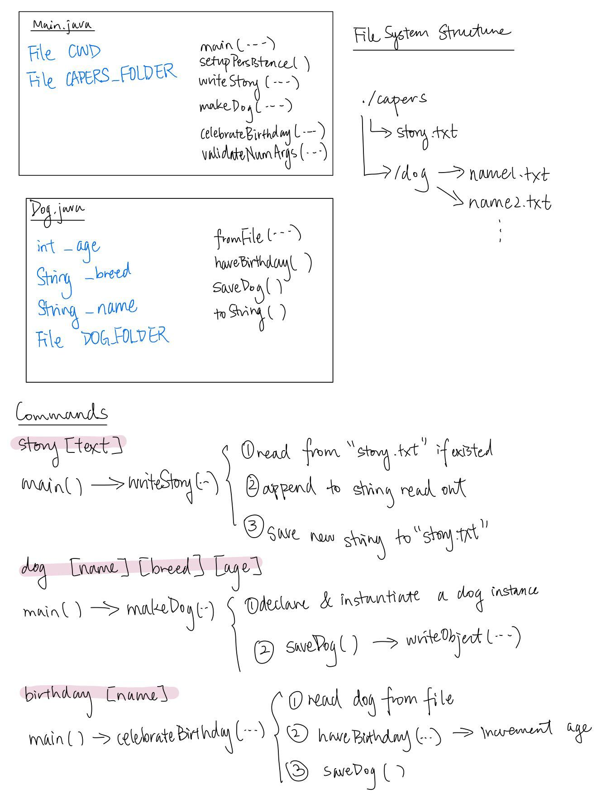

# Capers Lab Design Document

**Name**: Linda Deng

## Classes and Data Structures

### Main.java
This class is the entry point of the program. It implements methods to set up persistance and support each command of the program.

#### Fields

1. static final File CWD: A pointer to the current working directory of the program.
2. static final File CAPERS_FOLDER: A pointer to the `CAPERS` directory in the current working directory

### Dog.java
This class represents a dog instance. It has functions that computes a dog's birthday, converts the dog instance's string representation and supports reading and writing it from its corresponding saved file.

#### Fields
1. static final File DOG_FOLDER: A pointer to the directory persisting dog instances.
2. int _age: An int representing the age of dog.
3. String _breed: A string representing the breed of dog.
4. String _name: A string representing the name of dog.

## Algorithms

### Main.java
1. main(String[] args): This is the entry point of the program. It first checks to make sure that the input array is not empty. Then, it calls `setupPersistence` to create the `/.capers` and `/.capers/dogs` for persistance. Lastly, depending on the input argument, different functions are called to perform the operation.
2. setupPersistence(): If the directory for persisting dog instances does not exist yet, then make the directory. The directory `.capers` will be created at the same time when the `dog` directory is being made.
3. writeStory(String[] args): It appends the first non-command argument in args to a file called `story.txt` in the .capers directory. If the `story.txt` file exists, read out the content from the file and concatenate the string with the new content. Then, we print out the full story and writes it back to the `story.txt` file for persistence.
4. makeDog(String[] args): It creates and persistently saves a dog using the first three non-command arguments of args (name, breed, age).
5. celebrateBirthday(String[] args):  It advances a dog's age persistently and prints out a celebratory message. It also prints out the dog's information using toString().
6. exitWithError(String message): It prints out MESSAGE and exits with error code -1.
7. validateNumArgs(String cmd, String[] args, int n):  It checks the number of arguments versus the expected number and throws a RuntimeException if they do not match.

### Dog.java
1. Dog(String name, String breed, int age): It creates a dog object with the specified parameters.
2. fromFile(String name): It reads in and deserializes a dog from a file with name NAME in DOG_FOLDER. If a dog with name passed in doesn't exist, throw IllegalArgumentException error.
3. haveBirthday(): It increases a dog's age and celebrates.
4. saveDog(): It saves this dog instance to a file for future use.
5. toString(): It defines the string representation of a dog.

## Persistence

### story [text]
- When a new line of story is appended to the story, we concatenate it with existing lines from `story.txt` and write the updated story back to `story.txt`.

### dog [name] [breed] [age]
- For each dog, we write the object to a file called `name` in `.capers/dog/`.

### birthday [name]
- Read out the dog with `name` from its corresponding file in `.capers/dog/`.
- Increment the age of the dog instance by 1.
- Write the dog instance back to its corresponding file in `.capers/dog/`.

## Design Diagram

